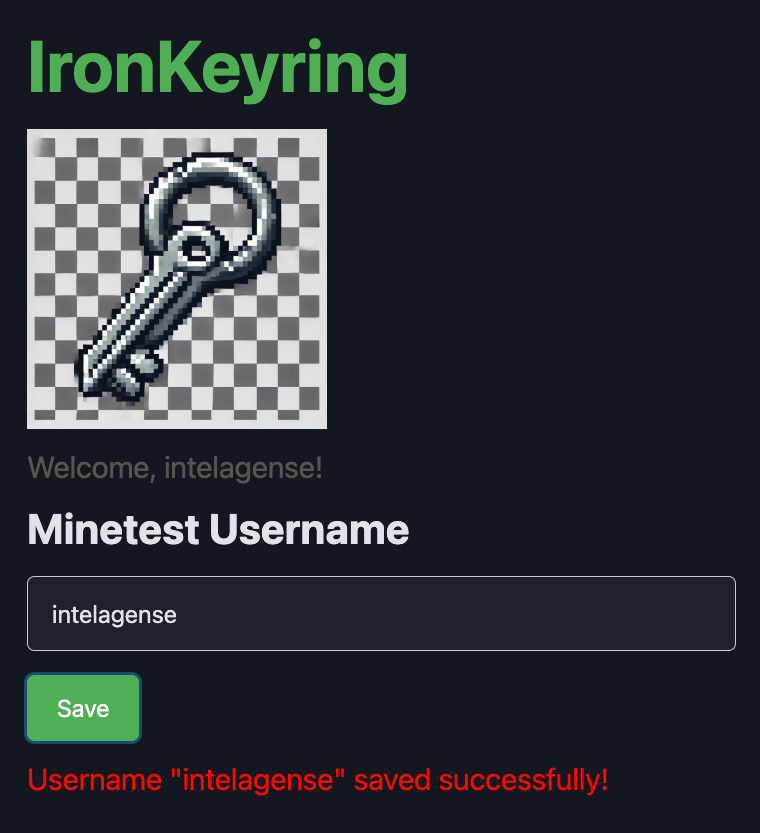

# IronKeyring

IronKeyring connects **Luanti(formally Minetest) usernames** to **Discord accounts** through **Appwrite** authentication.

### Current Features:
- Users log in via Discord.
- Links user Discord accounts to a **Luanti username**.

### Future Plans:
- **Resolve linking issues** between Discord UUID and Appwrite user ID.
- **Improve handling of OAuth data** to ensure Discord UUID is stored correctly.
- **Extend the app to support additional game integrations** including Minecraft.

Built for the 100devs mini-hackathon as bait to open a Minecraft server.